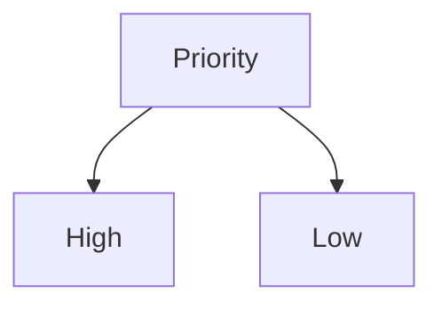
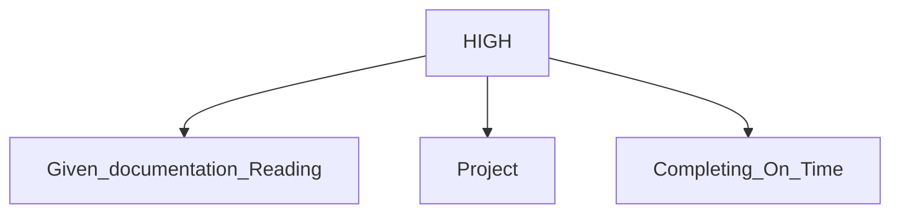
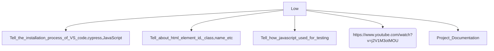

# 👉Output View
 </img>

# 👉Code Section
  ## Aim
  - Start doing Cypress Project as much as Possible
  - Read Carefully the given documentation and do the Work
  ## Things Required
  - [Cypress](https://www.cypress.io/)
  - [VS Code](https://code.visualstudio.com/)
  ## Procedure
  1. Next Day is the dead line need to complete as much as possible as per documentation.
  2. Set High and Low Priority Work.
  3. Do the High Priority Work first and then low priority.
  ## Theory
  - Cypress Commands Used
      - [x] `cy.visit()`: Navigates to a URL.
      - [x] `cy.xpath()`: Finds elements on the page).
      - [x] `cy.contains()`: Finds an element containing specific text.
      - [x] `cy.click()`: Simulates a click on an element.
      - [ ] `cy.type()`: Types text into an input field.
      - [ ] `cy.url()`: Asserts the current URL.
      - [x] `cy.should()`: Adds an assertion to verify that something should happen (e.g., an element is visible, contains text, etc.).

