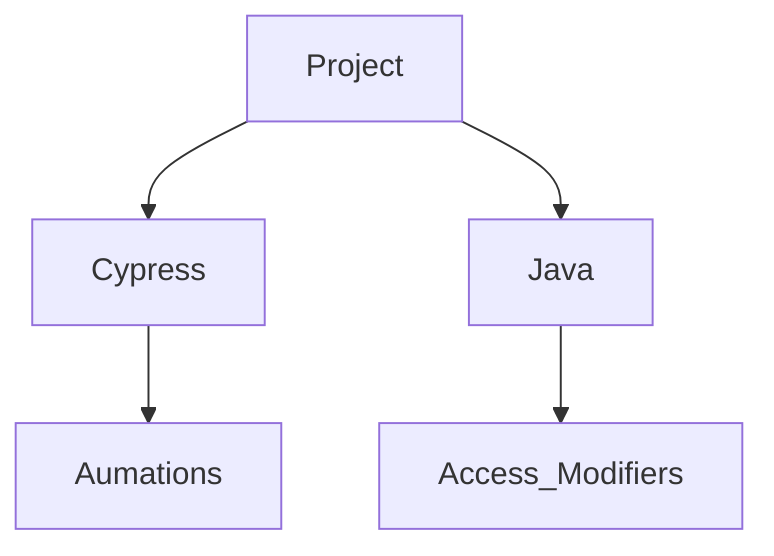

# Cypress Automation and Java Access Modifiers

## Introduction
Cypress is a powerful, modern front-end testing tool built specifically for web applications. It allows developers and testers to write automated tests to ensure the functionality, reliability, and performance of web apps. What sets Cypress apart from other testing frameworks is its ability to work directly with the browser, providing a fast, reliable, and easy-to-use testing environment.

Java Access Modifiers
In Java, access modifiers are keywords that control the visibility and accessibility of classes, methods, and variables. They determine who can access or modify the properties and behaviors of objects.

## Project Type
Cypress | Java

## Deplolyed Link
[Cypress](https://docs.google.com/document/d/1Vg_w7W7cWbaoCtJP8Od89vhW4WknQ8QN/edit): https://github.com/RouthKiranBabu/CWP_B39/tree/day_4/Cypress
[Java](https://docs.google.com/document/d/1fmLVD8mzY3hxNgZts477zthLmaUaeogFglJDPdfqqpw/edit#heading=h.jcs07vg2nrpd): https://github.com/RouthKiranBabu/CWP_B39/tree/day_4/Java

## Directory Structure


## Video Walkthrough of the project and codebase
 </img>

## Features
List out the key features of your application.

### Key Features of Cypress:
- `Real-time Reloads`: Automatically reloads tests on changes, offering instant feedback.
- `Automatic Waiting`: It waits for DOM elements to load, eliminating the need for manual wait commands.
- `Time Travel`: You can visually see each step of the test execution with a snapshot for easy debugging.
- `Built-in Assertions`: Provides built-in assertions that validate the behavior of your application during the test run.
- `Headless Browser Testing`: Supports running tests without a graphical interface using headless browsers.
- `Easy Setup`: Cypress doesn’t require complex setup or additional configurations. You just install the tool and can start writing tests.
Cypress is typically used for end-to-end testing, but it also supports integration and unit testing. It is particularly popular for testing JavaScript-based applications, but it works well with other tech stacks too.

### Key Features of Java Access Modifiers
1. Public:
   #### Features
   - Public members can be accessed by any other class or method.
   - Used for classes or methods that need to be available globally.
   - Public classes can be instantiated or extended from anywhere in the project.
   - Public methods and variables can be used by any other class directly.
     
2. Private:
   #### Features
   - Private members are hidden from all other classes.
   - It is the most restrictive access modifier.
   - Typically used to encapsulate class internals, providing data security and abstraction.
   - Getter and setter methods are often provided to access or modify private variables.

3. Protected:
   #### Features
   - Protected members are available to other classes within the same package.
   - Can be accessed by subclasses through inheritance, even if those subclasses are in a different package.
   - Often used in inheritance when you want to allow subclasses to access and modify the base class’s members, but hide those members from other parts of the program.

4. Default (Package-Private):
   #### Features
   - Default members can be accessed by other classes in the same package.
   - It is the default visibility if no access modifier is explicitly declared.
   - Ideal for package-level encapsulation where you want to share functionality only with classes in the same package.

## design decisions or assumptions
  1. Read the [Documentation](https://docs.google.com/document/d/1Vg_w7W7cWbaoCtJP8Od89vhW4WknQ8QN/edit) Carefully.
  2. Set High and Low Priority Work.
  3. Do the High Priority Work first and then low priority.

## Installation & Getting started
  - [Cypress](https://www.cypress.io/)
  - [VS Code](https://code.visualstudio.com/)

```bash
npm install my-project
cd my-project
npm start
```

## Usage
Watch the Given Video Shows the procedure to Use the Project.

## Credentials
Provide user credentials for autheticated pages

## APIs Used
None

## API Endpoints
None

## Technology Stack
List and provide a brief overview of the technologies used in the project.

- Node.js
- Cypress
- Visual Studio
- Sprint Tool Suite
- Git Bash
- Crome Browser

# 👉Code Section
  ## Aim
  - Start doing Cypress Project as much as Possible
  - Read Carefully the given documentation and do the Work
  ## Things Required
  - [Cypress](https://www.cypress.io/)
  - [VS Code](https://code.visualstudio.com/)
  ## Procedure
  1. Next Day is the dead line need to complete as much as possible as per documentation.
  2. Set High and Low Priority Work.
  3. Do the High Priority Work first and then low priority.
  ## Theory
  - Cypress Commands Used
      - [x] `cy.visit()`: Navigates to a URL.
      - [x] `cy.xpath()`: Finds elements on the page).
      - [x] `cy.contains()`: Finds an element containing specific text.
      - [x] `cy.click()`: Simulates a click on an element.
      - [ ] `cy.type()`: Types text into an input field.
      - [ ] `cy.url()`: Asserts the current URL.
      - [x] `cy.should()`: Adds an assertion to verify that something should happen (e.g., an element is visible, contains text, etc.).
      - [x] `cy.log()`: in Cypress is used to output custom messages to the test runner’s command log, useful for debugging purposes.
      - [x] `cy.screenshot()`: command in Cypress captures a screenshot during tests, useful for debugging and visual test validation.
      - [x] `cy.wait()`: Cypress is used to pause test execution for a specified time or until an alias resolves, improving synchronization.
